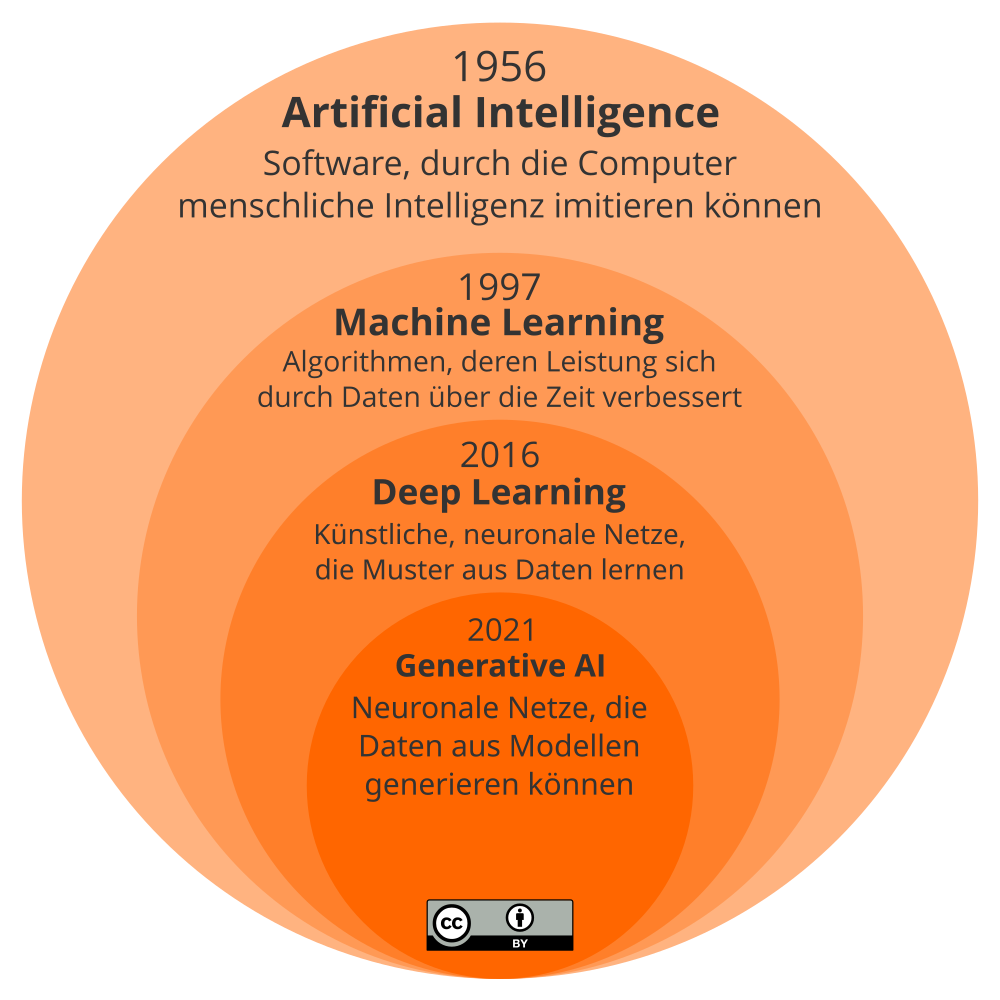

## Künstliche Intelligenz und Maschinelles Lernen

Der Titel dieses  LernOS Leitfadens ist **“Künstliche Intelligenz”**. In dem Grundlagenkapitel wollen wir etwas Ordnung in die Begrifflichkeit bringen, der man begegnet. Gleichzeitig wollen wir damit klären, womit wir uns in diesem Leitfaden näher beschäftigen: Mit dem Teil der KI-Anwendungen, die mit dem Begriff des **“Maschinellen Lernens”** und **"Generativer KI"** überschrieben werden. Künstliche Intelligenz umfasst insgesamt jedoch sehr viel mehr Spezialisierungen, mit denen wir in unserem Alltag konfrontiert sind, die wir hier jedoch nicht behandeln: Sprachassistenten wie Siri und Alexa, automatische Übersetzungen wie Google Tanslate, Gesichtserkennung für das Entsperren unserer Mobiltelefone oder persönliche Empfehlungssysteme basierend auf unserem früheren Konsumverhalten, um nur einige zu nennen.

Wir beschränken uns in diesem Leitfaden auf die **KI-Anwendungen**, mit denen **Bürger:innen** und **Mitarbeiter:innen** voraussichtlich direkt **in ihrem Alltag in Berührung kommen** und die sie selbst auch nutzen.

Wir haben in dieser Infographik eine hierarchische und gleichzeitig zeitliche Einordnung der wesentlichen Entwicklungsschritte der Künstliche Intelligenz dargestellt.  Seit ihrer ersten Erwähnung um 1956 bis zur Generativen KI 2021 kann sie als eine Reise von theoretischen Konzepten zu praktischen Anwendungen mit zunehmender Tiefe und Komplexität betrachtet werden. Seit Mitte des 20. Jahrhunderts hat sich die Landschaft von einfachen, regelbasierten Algorithmen zu komplexen Lernsystemen gewandelt, die in der Lage sind, menschenähnliche Aufgaben zu übernehmen und zu erfüllen.

### Künstliche Intelligenz
Der Begriff **Künstliche Intelligenz (KI)** wurde erstmals um 1956 verwendet. KI bildete das fundamentale Konzept für die Entwicklung "intelligenter" Maschinen. Die Anfänge waren geprägt von dem Bestreben, Maschinen zu schaffen, die grundlegende menschliche Intelligenzprozesse nachahmen können. Frühe KI-Systeme konnten einfache Aufgaben wie das Lösen von Logikrätseln oder das Spielen von Schach bewältigen. Der Fokus lag auf der Programmierung spezifischer Regeln, die es Maschinen ermöglichten, bestimmte Aufgaben zu erfüllen. KI ist der umfassendste Begriff und repräsentiert heute das gesamte Feld der Informatik, das darauf abzielt, intelligente Maschinen zu schaffen, die menschliche Intelligenz nachahmen oder übertreffen können. Es geht um Systeme, in der Lage sind, Aufgaben zu bewältigen, die normalerweise menschliches Denken erfordern, wie visuelle Wahrnehmung, Spracherkennung und Entscheidungsfindung. Das beinhaltet alles von einfachen programmierten Vorgängen bis hin zu komplexen Systemen, die lernen und sich anpassen können. Stell Dir das als den äußersten Kreis vor, den Oberbegriff, unter denen sich speziellere Konzepte und Anwendungen subsumieren lassen.

### Maschinelles Lernen
**Maschinelles Lernen (ML)** ist seit 1997 spezifischer Bereich innerhalb der KI, um Maschinen das Lernen aus Daten zu ermöglichen. ML markiert den Übergang von einer starren, regelbasierten KI zu adaptiven Systemen. Mit der Einführung des Machine Learnings wurde ein signifikanter Fortschritt erzielt, eine spezifischere Disziplin, die Maschinen befähigt, sich über die Zeit zu verbessern, um Entscheidungen zu treffen oder Vorhersagen zu machen. Machine Learning umfasst eine Vielzahl von Techniken, die es Computern ermöglichen, Muster in Daten zu erkennen und diese Erkenntnisse für zukünftige Aufgaben zu nutzen.

### Deep Learning
**Deep Learning** markiert den Durchbruch in der Fähigkeit von Maschinen, unstrukturierte Daten wie Bilder und menschliche Sprache zu verarbeiten und daraus zu lernen. Die Technik ist inspiriert von der Funktionsweise des menschlichen Gehirns. Hier werden Schichten von neuronalen Netzwerken genutzt, um große Mengen von Daten zu verarbeiten, komplexe Muster in Daten zu erkennen und Entscheidungen zu treffen.

### Generative KI
**Generative KI** repräsentiert den aktuellen Höhepunkt der KI-Entwicklung, die auf Deep Learning aufbaut. Sie geht über das reine Erkennen von Mustern hinaus und kann neue Inhalte erzeugen. Sie ist in der Lage, anhand von Vorgaben oder vorhandenen Daten neue geschriebene, visuelle und auditive Inhalte zu erstellen. Generative KI kann damit auch Inhalte erzeugen, die noch nicht in den Trainingsdaten für das Modell vorhanden waren, beispielsweise Musikstücke, Kunstwerke oder Texte, die von menschlichen Kreationen kaum zu unterscheiden sind.

### Large Language Modelle & Diffusion Modelle
Innerhalb der Generativen KI haben sich **Large Language Models (LLMs)**, wie das bekannte GPT (Generative Pre-trained Transformer der Fa. OpenAI) als entscheidend erwiesen. Diese Modelle sind darauf spezialisiert, menschliche Sprache zu verstehen und zu generieren, und haben aufgrund ihrer Fähigkeit, kohärente und relevante Texte zu produzieren, großes Aufsehen erregt und weite Verbreitung gefunden. LLMs haben neue Anwendungen in der Übersetzung, Zusammenfassung und in der Generierung von Programmcode ermöglicht. Eine weitere Spezialisierung innerhalb der Generativen KI sind die **Diffusion Models**. Diese Modelle stellen eine Innovation in der Bildgenerierung dar und sind in der Lage, Bilder von hoher Qualität zu erzeugen, die von realen kaum zu unterscheiden sind. Sie erweitern die Möglichkeiten in der Bildsynthese und bieten neue Werkzeuge für Designer und Kreative.

Jeder dieser Schritte erweiterte die Möglichkeiten der KI und verlagerte den Schwerpunkt von starren, regelbasierten Ansätzen hin zu adaptiven und selbstlernenden Systemen, die in der Lage sind, mit einer Vielfalt von Daten umzugehen und menschenähnliche Kreativität zu demonstrieren. KI bildet die Basis, Machine Learning ist die Methode, durch die Systeme aus Daten lernen, Deep Learning ist eine ausgefeilte Technik, die tiefe neuronale Netzwerke verwendet, und Generative KI ist die Spitze der Innovation, die es ermöglicht, neue Kreationen hervorzubringen. Jede Ebene baut auf dem Wissen und den Techniken der vorherigen auf und wird spezifischer und komplexer.

### Wichtige Meilensteine der Künstlichen Intelligenz

Die Geschichte der Künstlichen Intelligenz reicht zurück bis in die 1950er Jahre. Die folgende Tabelle gibt dir einen Überblick über die wichtigsten Meilensteine:

| Jahr             | Meilenstein                                                                                                                                                                                                                                                                                                                                                |
| ---------------- | ---------------------------------------------------------------------------------------------------------------------------------------------------------------------------------------------------------------------------------------------------------------------------------------------------------------------------------------------------------- |
| **1950**         | Alan Turing entwickelt den [Turing Test](https://en.wikipedia.org/wiki/Turing_test) (ursprünglich Imitation Game), um das intelligente Verhalten einer Maschine zu prüfen.                                                                                                                                                                                 |
| **1956**         | Der [Dartmouth Workshop](https://en.wikipedia.org/wiki/Dartmouth_workshop) ist die Geburtsstunde der **Künstlichen Intelligenz** als Fachgebiet.                                                                                                                                                                                                           |
| **1959**         | Allen Newell und Herbert A. Simon entwickeln den [Logic Theorist](https://en.wikipedia.org/wiki/Logic_Theorist), das erste KI-Programm.                                                                                                                                                                                                                    |
| **1966**         | Joseph Weizenbaum entwickelt [ELIZA](https://en.wikipedia.org/wiki/ELIZA), das die Kommunikation zwischen Mensch und Maschine in natürlicher Sprache ermöglicht.                                                                                                                                                                                           |
| **1967**         | [Dendral](https://en.wikipedia.org/wiki/Dendral) wird entwickelt, ein regelbasiertes System für die chemische Analyse, eine bedeutende KI-Leistung.                                                                                                                                                                                                        |
| **1969**         | [Shakey the Robot](https://en.wikipedia.org/wiki/Shakey_the_robot) wird der erste mobile Roboter, der logisch denken und Probleme lösen kann.                                                                                                                                                                                                              |
| **1970er**       | [Expertensysteme ](https://en.wikipedia.org/wiki/Expert_system) mit manuell erstellen Regeln werden entwickelt.                                                                                                                                                                                                                                            |
| **1973**         | Der [KI-Winter](https://en.wikipedia.org/wiki/AI_winter) beginnt aufgrund hoher Erwartungen und unerfüllter Ziele in der KI-Forschung.                                                                                                                                                                                                                     |
| **1980er Jahre** | [Expertensysteme](https://en.wikipedia.org/wiki/Expert_system) gewinnen an Popularität. Sie verwenden Regeln, um menschliches Fachwissen in engen Bereichen zu imitieren.                                                                                                                                                                                  |
| **1997**         | Das [Long Short-Term Memory](https://en.wikipedia.org/wiki/Long_short-term_memory) (LSTM) wird als wichtiger Algorithmus für **Machine Learning** veröffentlicht.                                                                                                                                                                                          |
| **1997**         | IBM [Deep Blue](https://en.wikipedia.org/wiki/Deep_Blue_(chess_computer)) besiegt den Schachweltmeister Garri Kasparow und demonstriert damit das Potenzial der KI.                                                                                                                                                                                        |
| **2011**         | [IBM Watson](https://en.wikipedia.org/wiki/IBM_Watson) gewinnt die Spielshow Jeopardy! und demonstriert damit die natürliche Sprachverarbeitung der KI.                                                                                                                                                                                                    |
| **2011**         | Apple's Sprachassisten [Siri](https://en.wikipedia.org/wiki/Siri) kommt auf den Markt.                                                                                                                                                                                                                                                                     |
| **2012**         | Geoffrey Hintons [Deep Learning](https://en.wikipedia.org/wiki/Deep_learning)-Techniken lassen das Interesse an neuronalen Netzwerken wieder aufleben.                                                                                                                                                                                                     |
| **2014**         | [Google DeepMind](https://en.wikipedia.org/wiki/Google_DeepMind) entwickelt ein neuronales Netzwerk, das lernt, Videospiele zu spielen.                                                                                                                                                                                                                    |
| **2016**         | [AlphaGo](https://en.wikipedia.org/wiki/AlphaGo) von DeepMind besiegt den Go-Weltmeister Lee Sedol und beweist damit das strategische Denken der KI.                                                                                                                                                                                                       |
| **2017**         | Die **Deep Learning** Architektur [Transformer](https://en.wikipedia.org/wiki/Transformer_(machine-learning_model)) wird vorgeschlagen, die weniger Trainingszeit benötigt, als vorherige Architekturen (RNN, LSTM)                                                                                                                                        |
| **2021**         | Der Begriff [Foundation Model](https://en.wikipedia.org/wiki/Foundation_models) (Grund- oder Basismodell) wird erstmals vom Center for Research on Foundation Models (CRFM) des Stanford Institute for Human-Centered Artificial Intelligence's (HAI) verwendet.                                                                                           |
| **2021**         | Die **generative KI** [DALL-E](https://en.wikipedia.org/wiki/DALL-E) zur Generierung von Bildern aus Text wird veröffentlicht.                                                                                                                                                                                                                             |
| **2021**         | [Ameca](https://en.wikipedia.org/wiki/Ameca_(robot)) ist ein humanoider Roboter, der von Engineered Arts entwickelt wurde. Ameca ist in erster Linie als Plattform für die Weiterentwicklung von Robotik-Technologien für die Mensch-Roboter-Interaktion gedacht. Die Interaktion kann entweder durch GPT-3 oder menschliche Telepräsenz gesteuert werden. |
| **2022**         | Der Chatbot [ChatGPT](https://en.wikipedia.org/wiki/ChatGPT), der das Large Language Model GPT-3.5 verwendet, wird veröffentlicht.                                                                                                                                                                                                                             |