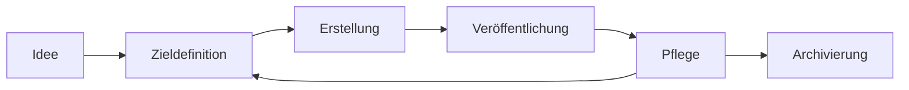

## Lebenszyklus eines Leitfadens

Von der Idee bis zur Fertigstellung durchläuft ein lernOS Leitfaden verschiedene Phasen, die wir als [Lebenszyklus](https://de.wikipedia.org/wiki/Lebenszyklus) des Leitfadens bezeichnen. Auch wenn die Geschichte jedes Leitfadens anders verläuft, lassen sich grob folgende Phasen benennen:

* **Idee** - dine Einzelperson oder eine Gruppe von Personen hat die Idee für einen lernOS Lernpfad oder einen lernOS Leitfaden.
* **Zieldefinition** - die Idee konkretisierte sich, Lernziel und Zielgruppe der Lernenden werden klarer. Oft entstehen hier auch schon erste Inhalte z.B. in Form von Skizzen, Mitschriften, Mailverkehr etc.
* **Erstellung** - in dieser Phase werden Struktur und Inhalte erstellt. Lernpfade können in Formaten wie Word, als Google Doc oder PowerPoint entstehen, lernOS Leitfäden haben immer Markdown als Quellformat.
* **Veröffentlichung** - der Leitfaden wir als Repository auf GitHub veröffentlicht. Standardmäßig werden neben Markdown die Formate PDF, Word, HTML, und E-Book (EPUB, Mobipocket) produziert. Ist der Lernpfad eines Leitfaden noch nicht in der Praxis getestet, empfehlen wir 0.x Versionsnummer. Nach absolviertem Praxistest erhält der Leitfaden dann die Versionsnummer 1.0. Diese sollte dann mindestens in Deutsch und Englisch vorliegen, um internationale Nutzung zu ermöglichen.
* **Promotion** - der Leitfaden wird bekannt gemacht und Lernende zur Nutzung animiert (wichtig für die Erhebung von Feedback). Das kann z.B. über die lernOS Community-Plattform [CONNECT](https://community.cogneon.de), den lernOS Community Call und den Twitter-Account [@lern_os](https://twitter.com/lern_os) erfolgen.
* **Pflege** - in dieser Phase kümmert sich der Autor (Maintainer) - idealerweise mit einem Team von Mit-Autoren - um die Pflege des Leitfadens, den Ausbau der Inhalte und die Einarbeitung von Feedback. Wir empfehlen, Leitfäden in regelmäßigen Abständen zu aktualisieren und dadurch kontinuierlich zu verbessern (z.B. vierteljährlich oder halbjährlich). Für die Planung der Weiterentwicklung eignet sich ein Knaben-Board z.B. als [GitHub Projekt Board](https://docs.github.com/en/enterprise/2.15/user/articles/about-project-boards) oder [Trello Board](https://de.wikipedia.org/wiki/Trello).
* **Archivierung** - wenn der Leitfaden nicht weiter gepflegt wird und die Inhalte veraltet und nicht mehr nutzbar sind, werden die Inhalte archiviert, bleiben aber weiterhin verfügbar.

**Siehe auch:**

* Wiki-Seite [How to release a new guide version](https://github.com/cogneon/lernos-core/wiki/How-to-release-a-new-guide-version).
* Wiki-Seite [How to fork a lernOS Guide](https://github.com/cogneon/lernos-core/wiki/How-to-fork-a-lernOS-Guide).
