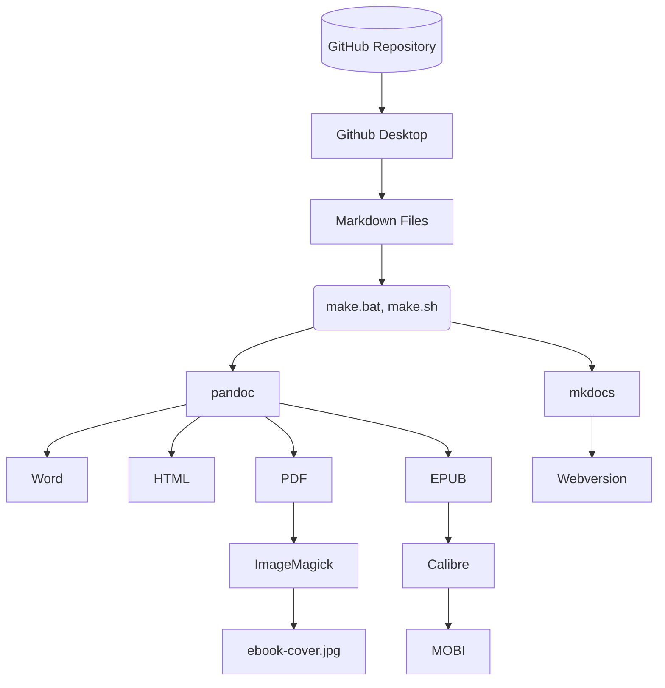
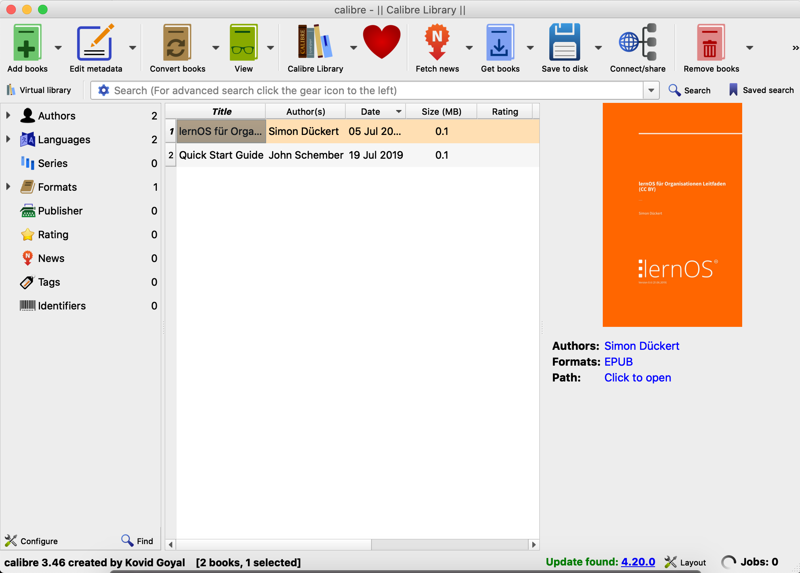

## Leitfaden Produktionskette

lernOS Leitfäden werden in der Auszeichnungssprache [Markdown](https://de.wikipedia.org/wiki/Markdown) erstellt und i.d.R. auf [GitHub](https://de.wikipedia.org/wiki/GitHub) verwaltet. Aus den Markdown-Quellen werden über die lernOS Produktionskette weitere Zielformate wie PDF, Word, E-Book etc. generiert. Diese Generierung kann zentral auf GitHub (noch nicht verfügbar) oder auf dem eigenen Rechner erfolgen.

Generiert man die Zieformate auf dem eigenen Rechner, ist ein Toolset notwendig, das im folgenden beschrieben wird. Wir versuchen wo möglich [Open Source Software](https://de.wikipedia.org/wiki/Open_Source) zu verwenden, die auf allen Plattformen verfügbar sind (Windows, Mac, Linux).



### lernOS Leitfaden Verzeichnisstruktur

Damit die lernOS Produktionskette funktioniert, müssen die Inhalte des Leitfadens in einem Dateiordner mit folgender Verzeichnisstruktur abgelegt werden (Beispiel für ein Leitfaden mit deutscher und englischer Version, fett sind Ordner- und Dateinamen, dahinter eine kurze Beschreibung):

```
lernos-repository
|– de                                # Sprachversion (nach ISO 639-1)
   |– slides                         # Präsentation (reveal.js)
   |– src                            # Markdown Quelldateien
      |– css                         # Mkdocs Stylesheet Customization
         |– extra.css                # CSS-Datei für Webversion
      |– images                      # Leitfaden Bilder
      |– overrides                   # Mkdocs Stylesheet Customization
      |– stylesheets                 # Mkdocs Stylesheet Customization
      |– 1-0-Grundlagen.md
      |– 2-0-Lernpfad.md
      |– 3-0-Anhang.md
      |– index.md                    # Willkommens-Kapitel (=Startseite)
   |– lernos-repository-de.docx      # Word-Version
   |– lernos-repository-de.epub      # E-Book-Version (epub)
   |– lernos-repository-de.html      # HTML-Version
   |– lernos-repository-de.mobi      # E-Book-Version (mobi)
   |– lernos-repository-de.pdf       # PDF-Version
   |– make.bat                       # Make-Datei (Windows)
   |– make.sh                        # Make-Datei (Mac, Linux)
   |– metadata.yaml                  # Metadaten für Pandoc
   |– mkdocs.yml                     # Steuerdaten für Webversion
|– docs                              # Webversionen (nach Sprache)
   |– de                             # Sprachversion (nach ISO 639-1)
|– README.md                         # Readme für Github
```

**Hinweis:** im Verzeichnis einer Sprachversion liegen zusätzlich alle produzierten Dokumente (z.B. docx, epub, html, mobi, pdf).

**Hinweis:** Für die Benennung der Verzeichnisse für weitere Sprachversionen werden die Kürzel nach [ISO 639-1](https://de.wikipedia.org/wiki/Liste_der_ISO-639-1-Codes) verwendet.

**Hinweis:** Im src-Verzeichnis kann der Leitfaden auch auf 1-2 Unterkapitelebene in einzelne Markdown-Dateien geteilt werden. Jede einzelne Markdown-Datei wird in der Webversion eine einzelne Seite (gut für thematische Kommentierung). Das ist z.B. auch sinnvoll, wenn mehrere Personen gleichzeitig an den Inhalten arbeiten oder die Inhalte in der Webversion auf Kapitelebene kommentierbar sein sollen.

### lernOS Produktionskette (on-premisis)

Für die Erstellung der Zielformate aus den Markdown-Quellen wird ein sog. [Makefile](https://de.wikipedia.org/wiki/Makefile) verwendet. Auf Windows ist das die Datei *make.bat* ([Stabelverarbeitungsdatei]([https://de.wikipedia.org/wiki/Stapelverarbeitungsdatei)), auf Mac und Linux *make.sh* ([Shell-Skript]([https://de.wikipedia.org/wiki/Shellskript)).

Ist die Produktionskette auf dem eigenen Rechner richtig eingerichtet, werden durch den Aufruf alle Zielformate automatisch generiert. Je nach Umfang und Geschwindigkeit des eigenen Rechners kann das bis zu einigen Minuten dauern.

**Ablauf der Produktionskette:**

1. Alte Versionen löschen
2. Webversion erstellen
3. Alle Versionen außer E-Book-Version erstellen
4. Cover-Bild aus PDF-Version extrahieren
5. E-Book-Versionen erstellen

**Beispiel make.sh auf Mac:**

```
echo Starting lernOS Guide Generation ...

# Variables
filename="lernOS-Template-Guide-de"
chapters="./src/index.md ./src/1-0-Grundlagen.md ./src/1-1-Grundidee.md ./src/1-2-Lebenszyklus.md ./src/1-3-Inhaltsverzeichnis.md ./src/1-4-Inhalt.md ./src/1-5-Produktionskette.md ./src/2-Lernpfad.md ./src/3-Anhang.md"

# Delete Old Versions
echo Deleting old versions ...
rm -rf $filename.*
rm -rf ../docs/de/*
rm -ff ../docs/de-slides/index.html

# Create Web Version (mkdocs)
echo Creating Web Version ...
mkdocs build

# Create Microsoft Word Version (docx)
echo Creating Word version ...
pandoc metadata.yaml --from markdown -s --resource-path="./src" -F mermaid-filter --number-sections -V lang=de-de -o $filename.docx $chapters

# Create HTML Version (html)
echo Creating HTML version ...
pandoc metadata.yaml --from markdown -s --resource-path="./src" -F mermaid-filter --number-sections -V lang=de-de -o $filename.html $chapters

# Create PDF Version (pdf)
echo Creating PDF version ...
pandoc metadata.yaml --from markdown -s --resource-path="./src" -F mermaid-filter --template lernos --number-sections --toc -V lang=de-de -o $filename.pdf $chapters

# Create eBook Versions (epub, mobi)
echo Creating eBook versions ...
magick -density 300 $filename.pdf[0] src/images/ebook-cover.jpg
mogrify -size 2500x2500 -resize 2500x2500 src/images/ebook-cover.jpg
mogrify -crop 1563x2500+102+0 src/images/ebook-cover.jpg
pandoc metadata.yaml --from markdown -s --resource-path="./src" -F mermaid-filter --epub-cover-image=src/images/ebook-cover.jpg --number-sections --toc -V lang=de-de -o $filename.epub $chapters
ebook-convert $filename.epub $filename.mobi

# Create Slides (revealjs)
# echo Creating Presentation ...
# pandoc metadata.yaml --from markdown -s --resource-path="./src" -t revealjs -V theme=night -s ./slides/index.md -o ../docs/de-slides/index.html
```

### lernOS Produktionskette (Cloud)

Die lernOS Produktionskette kann über [Github Actions](https://github.com/features/actions) auch in der Cloud betrieben werden, was deutlich einfach ist, als alle Tools auf dem lokalen Rechner zu installieren. Grundsätzlich funktioniert die Produktionskette ähnlich, wie on-premisis, mit kleinen Unterschieden:

- Der Workflow der lernOS Produktionskette wird über die Datei `.github/workflows/lernos-produktionskette.yml` gesteuert.

- Der Workflow läuft auf der aktuellen Ubuntu Linux Version.

- Der Workflow verwendet die [Pandoc-Docker-Container](https://hub.docker.com/r/pandoc/core) (pandoc/core und pandoc/extra) und installiert mkdocs-material, um die einzelnen Artefakte zu erzeugen.

### Ideen für die Erweiterung der lernOS Produktionskette

Wie auch die Leitfäden wird die lernOS Produktionskette kontinuierlich erweitert. Einige Ideen für die Erweiterung:

* **OneNote:** zusätzlich Produktion einer OneNote-Version der Leitfäden (aktuell nur als Begleitdokument, das manuell gepflegt werden muss).
* **Audiobook:** Produktion eines Audiobooks mit Kapitelmarken zum Anhören (z.B. mit [Balbolka](http://www.cross-plus-a.com/balabolka.htm)).
* **Maschinelle Übersetzung:** Nutzung der DeepL API, um Leitfäden in der Produktionskette automatisch übersetzen zu lassen (Mit curl).
* **Kindle Direct Publishing:** Veröffentlichung der E-Book-Versionen auf dem Amazon Marktplatz.
* **TeX:** können wir auf allen Plattformen MiKTeX verwenden?
* **Pandoc Optionen:** alle Optionen und Parameter von pandoc in eine Defaults-Datei auslagern, damit sie nicht in make.sh und make.bat parallel gepflegt werden müssen (-d options.yaml statt metadata.yaml)

## Toolset für die Produktionskette

Für die lernOS Produktionskette sind einige Tools auf dem eigenen Rechner oder in der Cloud erforderlich:

1. **Markdown-Editor** - zum Editieren der Inhalte der Leitfäden, die alle in [Markdown](https://de.wikipedia.org/wiki/Markdown) geschrieben werden (z.B. [Mark Text](https://marktext.app), [Typora](https://typora.io) oder [Atom](https://atom.io)).

2. **Github Desktop** - mit [Github Desktop](https://desktop.github.com) kann das Repository des Leitfadens auf GitHub mit dem lokalen Rechner synchronisiert werden.

3. **Pandoc** - mit [Pandoc](https://pandoc.org) werden die Markdown-Dateien in die Zielformate der lernOS Produktionskette konvertiert.

4. **LaTeX** - um PDF-Dateien erzeugen zu können benötigt Pandoc LaTeX (z.B. [MiKTeX](https://miktex.org) auf Windows oder [MacTeX](https://www.tug.org/mactex) auf dem Mac).

5. **MkDocs** und **Material for MkDocs** - mit [MkDocs](https://www.mkdocs.org) wird die Webversion des Leitfadens erstellt, [Material](https://squidfunk.github.io/mkdocs-material/https://squidfunk.github.io/mkdocs-material) ist das verwendete Theme.

6. **ImageMagick** - mit [ImageMagick](https://imagemagick.org) wird aus der Titelseite der PDF-Version eine Grafik zum Einfügen in die E-Book-Version.

7. **Calibre** - zur Konvertierung der von Pandoc erzeugten E-Book-Version im epub-Format in das mobi-Format wird [Calibre](https://calibre-ebook.com) eingesetzt.

### Typora

[Typora](https://typora.io/) ist ein Text-Editor zur Bearbeitung von [Markdown](https://en.wikipedia.org/wiki/Markdown)-Inhalten. Typora ist für lernOS Inhalte der empfohlene Markdown-Editor, weil er plattformübergreifend verfügbar ist und Markdown als echtes WYSIWYG (What You See Is What You Get) anzeigt. Markdown kann man prinzipiell auch mit einfac    hen Texteditoren erstellen und bearbeiten, gerade für Einsteiger ist die WYSIWYG-Ansicht aber von Vorteil.

**Hinweis:** Typora war in der Beta-Phase kostenlos und kostet jetzt ca. 15,- Dollar. Um eine kostenfreie Alternative empfehlen zu können, testen wir gerade Mark Text.


### Pandoc

[Pandoc](https://pandoc.org) ist ein Komandozeilen-basierter Text-Konverter, der Markdown in andere Formate konvertieren kann. Beispiel für die Konvertierung von Markdown in Microsoft Word:

```
pandoc dokument.md -o dokument.docx
```

Zu den von Pandoc unterstützten Formaten gehören u.a. Asciidoc, DokuWiki, EPUB (E-Book), HTML, LaTeX, Markdown, MediaWiki, Microsoft PowerPoint, Microsoft Word (docx), OpenOffice/LibreOffice (odt), Reveal.js (Online-Präsentationen), Textile (z.B. für Confluence), uvm.

In der lernOS Produktionskette werden weitere [pandoc-Optionen](https://pandoc.org/MANUAL.html#options)) verwendet:

- metadata.yaml: Metadaten wie Titel, Autor, Version etc.

- -f markdown: Spezifikation des Quellformats (Markdown)

- -s: Generierung von "Standalone" Versionen, d.h. z.B. vollständiges HTML, nicht nur Fragmente

- --resource-path: Pfad, in dem Ressourcen und Bilder gesucht werden

- -F mermaid-filter: Filter, um Mermaid-Syntax in Diagramme zu konvertieren

- --template: Verwendung eines Templates, z.B. bei der PDF-Version

- --number-sections: Nummerierung von Überschriften

- -V lang=de-de: Variable für die Sprache setzen

- -o: Ausgabe-Datei (z.B. Word, PDF)

### GitHub Desktop

[Github Desktop](https://desktop.github.com) ist ein Client, der [GitHub](https://de.wikipedia.org/wiki/GitHub) Repositories mit dem lokalen Rechner synchronisieren kann. Somit kann z.B. lokal an Markdown-Inhalten gearbeitet und diese bei Bedarf ins Repository synchronisiert werden. Die Funktionsweise kann man sich ähnlich wie die Synchronisation von Dateien mit Dropbox oder OneDrive vorstellen.


### LaTeX & Co.

[LaTeX](https://de.wikipedia.org/wiki/LaTeX) ist ein Programmpaket, um im TeX-Format geschriebene Textdokumente in Formate wie HTML oder PDF zu konvertieren. In der lernOS Produktionskette wird wird eine LaTeX-Distribution (z.B. [MiKTeX](https://miktex.org)) verwendet, um mit pandoc direkt PDF-Dateien generieren zu können (Befehl: *pdflatex*).

Als Vorlage für die PDF-Erstellung der lernOS Leitfäden wird das pandoc LaTeX Template [Eisvogel](https://github.com/Wandmalfarbe/pandoc-latex-template) verwendet und über die Datei *metadata.yaml* angepasst. Für den Einsatz dieser Vorlage werden bei erstmaligen Verwendung weitere LaTeX-Erweiterungen installiert.

### MkDocs & Material for MkDocs

[MkDocs](https://www.mkdocs.org/) ist statischer Webseiten Generator, der die responsive Webversion mit Navigation, Suche, Social Links und Kommentarfunktion erzeugt. Als Theme kommt bei der Web-Version der lernOS Leitfäden [Material for MkDocs](https://squidfunk.github.io/mkdocs-material/) zum Einsatz.


### Disqus

Für die Kommentarfunktion am Ende jeder Seite der Web-Version kommt der Dienst [Disqus](https://de.wikipedia.org/wiki/Disqus) zum Einsatz. Alle Leitfäden teilen sich das gleiche Disqus-Konto (lernos).


### Calibre

[Calibre](https://calibre-ebook.com) ist eine E-Book-Management-Software, die für die Konvertierung der E-Book-Version [EPUB](https://de.wikipedia.org/wiki/EPUB) in [Mobipocket](https://de.wikipedia.org/wiki/Mobipocket) (mobi, z.B. für Kindle Reader und Kindle App) zu erzeugen. Um aus der PDF-Version eines Leitfadens das Titelbild als Grafik zu extrahieren und in die richtige Größe für E-Books zu skalieren kommt das Grafik-Paket [ImageMagick](https://www.imagemagick.org) zum Einsatz.


