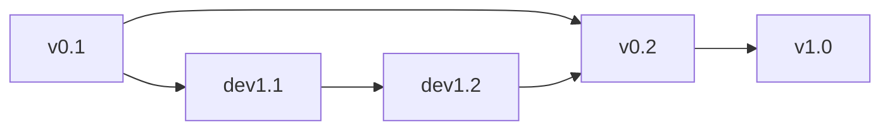

## GitHub

[GitHub](https://github.com) ist ein Internet-Dienst zur verteilten Verwaltung von Software-Entwicklungsprojekten. Mit dem Ansatz "Content as Code" werden die Inhalte der lernOS Leitfäden in Markdown (wie Quelltext einer Software) geschrieben und dann mit der Produktionskette in die Zielformate konvertiert.

Falls im Leitfaden-Team noch keine Erfahrungen mit Git und GitHub vorliegen, hier einige Links zum einarbeiten:

- [Git](https://de.wikipedia.org/wiki/Git) in Wikipedia

- [GitHub](https://de.wikipedia.org/wiki/GitHub) in Wikipedia

- Video [Was ist GitHub?](https://www.youtube.com/watch?v=3ZlpJHZBbi8) auf YouTube

- Crash-Kurs [Git and GitHub for Beginners](https://www.youtube.com/watch?v=RGOj5yH7evk) auf YouTube

Das GitHub Repository wird nach dem [Git-Flow-Workflow von Atlassian](https://www.atlassian.com/de/git/tutorials/comparing-workflows/gitflow-workflow) verwaltet. Dabei ist im Master-Branch immer die aktuell gültige Version des Leitfadens. Im Develop-Branch werden Änderungen gemacht, die dann für eine neue Version mit einem Pull Request übernommen werden.

